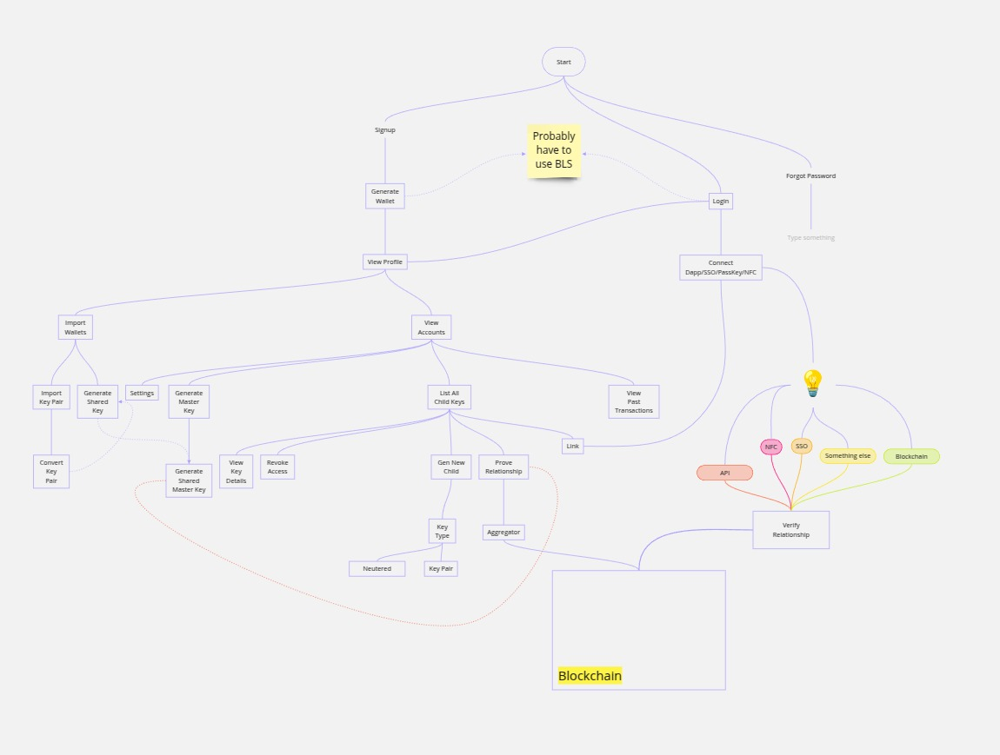

# [WIP] Nessa

## Introduction

Nessa is a self-hosted, multichain DID protocol (being developed as an infrastructure) that uses ZKP and a p2p layer. It natively supports keyless-auth and OAuth. 

### Flow
   

### Security Notice

- **Key Exposure**: The example code prints private keys for demonstration. In a real‐world application, never log or expose private keys.  
- **Production Readiness**: This demonstration does not include secure storage, hardware wallet integration, or comprehensive error handling. For a production environment, additional safeguards are required.  
- **Entropy**: When creating a new key (`NewKey()`), the code depends on `crypto.GenerateKey()` from Go’s standard library, which is sufficiently secure for most use cases but should still be handled carefully.

### Contributions and Credits
This project was developed during the [Encode](https://www.encode.club/) Expander Bootcamp (Q1 2025), focusing on [Polyhedra's Expander](https://www.polyhedra.network/expander) proof generation backend. Contributors include (Discord usernames):

- soumyadeep_02 (Roy)
- dgallegos. (Diego)
- raadhhaseeb (Haseeb)

---

### License

All files are provided under the terms of the [MIT License](https://opensource.org/licenses/MIT). See the [LICENSE](LICENSE) file for details. 

---

**Disclaimer:** Use this repository at your own risk. While it may serve as a valuable learning tool, it is not audited or officially supported for handling significant funds or sensitive operations. AI was used to generate portions of the code.